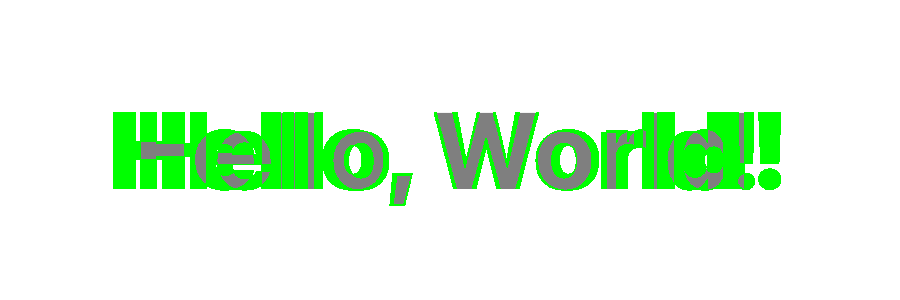
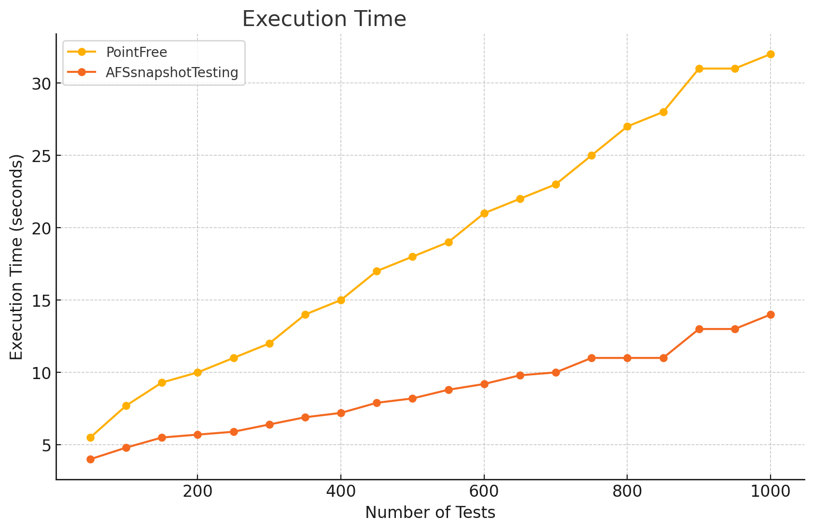
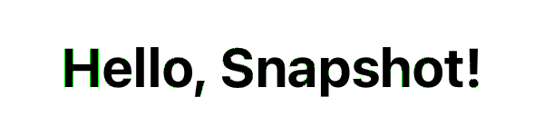

# AFSnapshotTesting
Esta es la biblioteca más rápida para crear pruebas que capturen instantáneas de tus componentes visuales. Al admitir los algoritmos de comparación más avanzados e introducir sus propios métodos de comparación innovadores, combinados con opciones de configuración altamente flexibles e imágenes de diferencia dependientes del algoritmo, te permite lograr resultados casi perfectos a nivel de píxel y mejorar tu experiencia de pruebas. Su principal característica distintiva es el uso de [shaders computados de Apple Metal](https://developer.apple.com/documentation/metal/performing-calculations-on-a-gpu) para habilitar algoritmos de análisis de imágenes `GPU` paralelos de alto rendimiento.

## Ejemplo

### 1. UIView

```swift
import AFSnapshotTesting

class ExampleTests: XCTestCase {
    func testViewIphone14() {
        let view = View()
        assertSnapshot(view, on: .iPhone14)
    }

    func testViewSomeSize() {
        let view = View()
        assertSnapshot(view, on: (size: CGSize(width: 100, height: 300), scale: 3))
    }

    func testDarkMode() {
        let traits = [ UITraitCollection(userInterfaceStyle: .dark) ]
        assertSnapshot(view, on: .iPhone14, traits: traits)
    }
}
```

### 2. UIImage

```swift
import AFSnapshotTesting

class ExampleTests: XCTestCase {
    func testImage() {
        let image = UIImage(named: "example-image-from-resources")
        assertSnapshot(image)
    }
}
```

### 3. XCUIElement

```swift
import AFSnapshotTesting

class MainSteps: BaseSteps {
    func assertSnapshotForPaymentSection() {
        let paymentElement = mainScreen.paymentElement()
        assertSnapshot(paymentElement)
    }
}
```

## Instalación
### Swift Package Manager
```swift
dependencies: [
    .package(url: "https://github.com/afanasykoryakin/apple-metal-snapshot-testing")
]
```
## Características
1. **Detección automática de diferencias**  
   Cuando una prueba de instantánea falla, se genera automáticamente una imagen de `diferencia` para resaltar las discrepancias. Usa el parámetro de selección de color para ajustar la representación visual de las diferencias entre la instantánea de referencia y la actual. Esto facilita identificar los cambios.

   ```swift
   // Ejemplo de uso
   assertSnapshot(..., differenceColor: .green)
   ```

   

    Gracias a tecnologías únicas, **la imagen se genera con precisión según el algoritmo seleccionado**.

2. **Tolerancia de píxeles personalizable**  
   Ajusta tus pruebas estableciendo un umbral para el número de píxeles no coincidentes permitidos. Puedes controlar el tamaño de los clústeres de píxeles y definir tolerancias para eliminar falsos positivos causados por discrepancias visuales menores. [nuevos ajustes](#3-discrete-settings)

    ```swift
    🙁
    //SnapshotTesting de PointFree:
    assertSnapshot(as: .image(precision: 0.999999999))
    ```
    ```swift
    😎
    // AFSnapshotTesting 
    // Ignorar 10 píxeles está bien 
    assertSnapshot(as: .naive(threshold: 10))
    ```

3. **Creación automática de referencias**  
   Al ejecutar las pruebas por primera vez, la biblioteca crea automáticamente imágenes de referencia para comparaciones futuras.

4. **Múltiples pruebas en un solo caso de prueba (usando `named`)**  
   
   El parámetro `named` te permite ejecutar múltiples pruebas de instantáneas dentro de un solo caso de prueba. Esto es útil para probar diferentes estados de un componente de IU, como después de presionar un botón u otras interacciones, sin necesidad de dividirlas en casos de prueba separados.

    ```swift
    func testInteraction() {
       // Ejemplo de uso con `named`
	   assertSnapshot(view, named: "initialState")
	   // Simular presión de botón
	   assertSnapshot(view, named: "afterButtonPress")
    }
    ```

5. **[Minimizar el impacto de las variaciones de renderizado en diferentes procesadores y sistemas operativos](#2-minimizing-the-impact-of-rendering-variations-across-different-processors-and-operating-systems)** 
    
    Los problemas de renderizado son fundamentales para las herramientas de pruebas de instantáneas ([leer más](#2-minimizing-the-impact-of-rendering-variations-across-different-processors-and-operating-systems)). 

    - Tolerancia de píxeles con Delta-E CIE2000 ([leer más](#12-perceptual-tollerance-strategy))
    ```swift
    // ✅ umbral: 10 - Ignorar 10 píxeles está bien. Pero ahora, agreguemos un umbral de deltaE = 1.0, lo que significa que ignoramos diferencias que son imperceptibles para el ojo humano.
    assertSnapshot(as: .perceptualTollerance(threshold: 10,  deltaE: 1.0))  

    // 🔙 Para compatibilidad total con versiones anteriores de pointfree
    assertSnapshot(as: .perceptualTollerance_v2(precission: 0.999, perceptualPrecision: 0.99))
    ```
    - [Estrategia de análisis de clústeres](#11-clusters-strategy)
    ```swift
    assertSnapshot(as: .cluster(threshold: 0, clusterSize: 2))
     ```
## Características distintivas
### 1. El más rápido del mundo
 AFSnapshotTesting ejecuta 1000 pruebas 2.3 veces más rápido que [swift-snapshot-testing](https://github.com/pointfreeco/swift-snapshot-testing) v1.16.0 de PointFree, aprovechando computaciones paralelas en la GPU para lograr un mayor rendimiento.



#### 1.1 Entorno de pruebas
El rendimiento y la precisión de las pruebas se evaluaron en un nuevo módulo SPM, que incluye dependencias de AFSnapshotTesting v1.0.0 y [swift-snapshot-testing](https://github.com/pointfreeco/swift-snapshot-testing) v1.16.0.

La velocidad es ciertamente una ventaja útil, pero no es el foco principal. En cambio, considera otras características únicas como parámetros de umbral enteros, [análisis de clústeres](#11-clusters-strategy) e imágenes de diferencia reales.
##### 1.1.1 Entorno de pruebas
1. Xcode 15.3 + Simulador iOS;
2. MacBook Pro 14" 2021, Apple M1 PRO, 16GB;
3. macOS Sonoma 14.1;

- Las pruebas se realizaron en una compilación en caliente.
- El plan de pruebas incluyó modo de ejecución en paralelo, con cada clase de prueba conteniendo 10 pruebas.
- Las optimizaciones de `memcpu` se desactivaron en el código fuente de [swift-snapshot-testing](https://github.com/pointfreeco/swift-snapshot-testing) v1.16.0. (véase. [1.1.3 Simulación de valores atípicos](#113-simulating-outliers))
##### 1.1.2 Parámetros de prueba
1. Creación de un componente gráfico con una resolución de 1170 × 2532, equivalente a la pantalla del iPhone 14;
2. Configuración de degradado;
3. Para [SnapshotTesting](https://github.com/pointfreeco/swift-snapshot-testing) v1.16.0.  `perceptualPrecision: 0.99`;
4. Para AFSnapshotTesting `СlusterStrategy`;
##### 1.1.3 Simulación de valores atípicos
[swift-snapshot-testing](https://github.com/pointfreeco/swift-snapshot-testing) v1.16.0 incluye optimizaciones que permiten omitir los algoritmos de comparación y manejo de valores atípicos cuando no son necesarios. Con fines experimentales, se decidió modificar el código fuente de la biblioteca para desactivar estas optimizaciones.

En el archivo `UIImage.swift`, se realizaron cambios comentando las líneas 118 y 129 para excluirlos del proceso de compilación:

```swift
if memcmp(oldData, newData, byteCount) == 0 { return nil }
```

La optimización `memcmp` compara rápidamente dos bloques de memoria de la misma longitud y devuelve 0 si son idénticos. Si los bloques de memoria de la instantánea de referencia y el renderizado son exactamente los mismos, los algoritmos se pueden omitir.
### 2. Minimizar el impacto de las variaciones de renderizado en diferentes procesadores y sistemas operativos
  

Diferencia al intentar comparar en el simulador iPhone 15 Pro **iOS 18 vs. iOS 17.2**. (Xcode 15.3, MacBook M1 Pro)

#### 1.1 Estrategia de clústeres
Los algoritmos existentes para minimizar el impacto de los valores atípicos, basados principalmente en enfoques similares a la sensibilidad al color (deltaE2000), ya son bastante rápidos. Si bien un aumento significativo en la velocidad es una mejora bienvenida, no es críticamente importante.

**El logro clave es la creación de un algoritmo paralelo para minimizar el impacto de los valores atípicos en la GPU, basado en el análisis del tamaño de [clústeres interconectados](https://courses.cs.washington.edu/courses/cse576/book/ch3.pdf).**

Por naturaleza, los valores atípicos suelen estar aislados o formar pequeños clústeres, lo cual es significativamente diferente de las diferencias causadas por cambios reales en el desarrollo.

La idea de usar análisis de clústeres no es completamente nueva. Los enfoques existentes reciben comentarios positivos como método para minimizar valores atípicos, pero son críticamente lentos.

En las implementaciones tradicionales basadas en `CPU`, se tarda un promedio de 1 segundo en realizar una sola prueba. Esto significa que ejecutar mil pruebas tardaría aproximadamente 16.6 minutos. La implementación paralela en la `GPU` realiza el mismo trabajo en 5 segundos, lo que es 200 veces más rápido.
#### Agrupación de cambios significativos
- El algoritmo de análisis de clústeres observa un píxel no coincidente y verifica si está aislado o es parte de un clúster. Esto ayuda a determinar si los cambios son parte de una modificación más grande (como un rediseño de componente) o solo cambios aleatorios e aislados. De esta manera, el análisis de clústeres ayuda a identificar la naturaleza de los cambios de IU y reduce el número de fallos falsos en las pruebas.

*P.D. El análisis basado en sensibilidad al color es el estándar de la industria, y no a todos les puede convenir alejarse de él. La arquitectura modular existente permite la creación del algoritmo de sensibilidad de color CIED2000 como una estrategia de prueba independiente. Además, puedes crear algoritmos combinados que incorporen tanto el análisis de sensibilidad al color como el análisis de clústeres, lo que proporcionará aún mayor precisión y eficacia.*
#### 1.2 Estrategia de tolerancia perceptual

La tolerancia perceptual se refiere a un método de comparación de imágenes que tiene en cuenta la percepción visual humana. Ignora diferencias menores de renderizado que serían indistinguibles para el ojo humano. 

Los algoritmos basados en tolerancia perceptual [Delta E (CIE 2000)](http://www.brucelindbloom.com/index.html?Eqn_DeltaE_CIE2000.html) se han convertido en el estándar de la industria para pruebas de instantáneas (gracias a [swift-snapshot-testing](https://github.com/pointfreeco/swift-snapshot-testing) de PointFree), permitiendo a los desarrolladores minimizar falsos positivos causados por diferencias menores de renderizado entre plataformas. Dada su amplia adopción, también he implementado un algoritmo similar. 

| $\Delta E$ | Percepción                              |
| ---------- | --------------------------------------- |
| <= 1.0     | Invisible al ojo humano.       |
| 1 - 2      | Se percibe tras un examen cuidadoso.  |
| 2 - 10     | Se percibe a simple vista.              |
| 11 - 49    | Los colores son más similares que opuestos. |
| 100        | Los colores son exactamente opuestos              | 

```swift
// SnapshotTesting de PointFree:
// precision: 0.999 - la imagen debe coincidir al 99%, pero este es un parámetro relativo que causará dificultades
assertSnapshot(as: .image(precision: 0.999, perceptualPrecision: 0.99))
```

```swift
😎
// AFSnapshotTesting 
// ✅ umbral: 10 - Ignorar 10 píxeles está bien 
assertSnapshot(as: .perceptualTollerance(threshold: 10))  

// ✅ umbral: 10 - Ignorar 10 píxeles está bien. Pero ahora, agreguemos un umbral de deltaE = 1.0, lo que significa que ignoramos diferencias que son imperceptibles para el ojo humano.
assertSnapshot(as: .perceptualTollerance(threshold: 10, deltaE: 1.0))  

// Para compatibilidad total con versiones anteriores de pointfree.
assertSnapshot(as: .perceptualTollerance_v2(precission: 0.999, perceptualPrecision: 0.99))
```
#### 1.3 Estrategia combinada (filtro de clústeres + Tolerancia perceptual)
La estrategia te permite reducir el umbral DeltaE y filtrar los grupos restantes

```swift
case combined(threshold: Int, clusterSize: Int, deltaE: Float)
// umbral: 10 - Ignorar 10 píxeles está bien 
// clusterSize: 5 - Tamaño mínimo de clúster para contar coincidencias fallidas (clústeres más pequeños se ignoran como ruido)
// deltaE: 2 - Se percibe tras un examen cuidadoso. (Ver tabla)
assertSnapshot(view, as: .combined(threshold: 10, clusterSize: 5, deltaE: 5))  
```
## Resumen
Gracias. mi [tg](https://t.me/afanasykoryakin)
## Licencia
Licencia: MIT, https://github.com/afanasykoryakin/AFSnapshotTesting/blob/master/LICENSE
